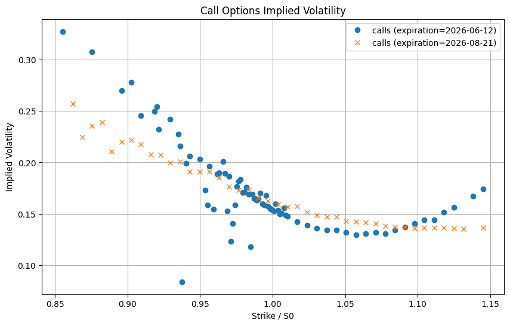
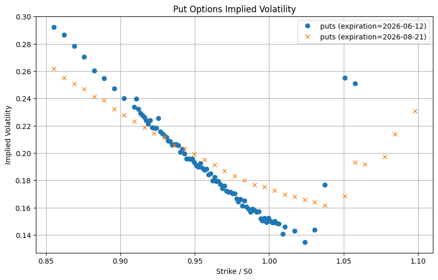

# Implied Volatility Smile Project

This project analyzes SPY option prices and extracts implied volatility using the Black-Scholes model. The objective is to study how implied volatility varies across strike prices and maturities.

## Data
- SPY call and put options
- Source: yfinance
- Maturities: selected expirations around 1 month and 3 months

## Methods
- Black-Scholes model
- Numerical inversion to compute implied volatility
- Visualization of implied volatility against strike prices

## Main Findings
- I selected two expiration dates, 2026-06-12 and 2026-08-21, with the observation date set to 2026-05-13. The implied volatility curves for both call and put options are not constant across strikes. One possible explanation is that investors anticipate potential market downturns, which increases the demand for out-of-the-money put options. This higher demand raises put prices and therefore increases their implied volatilities. Through put-call parity, this can also affect call prices.
- I also find that the implied volatility curve becomes flatter for longer-maturity options. This suggests that the sensitivity of implied volatility to strike price is weaker for longer-dated options than for shorter-dated options.

